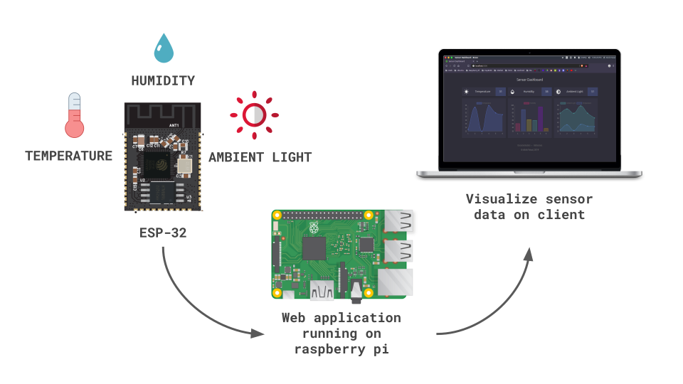

# Full Stack Sensor Dashboard  
[](https://github.com/ellerbrock/open-source-badges/) [](https://opensource.org/licenses/GPL-3.0/) [](https://GitHub.com/Naereen/StrapDown.js/graphs/commit-activity)

<br>

<p align="center">
  
</p>

## Working Principle
<p align="center">
  
</p>

## How to use

#### 0. Install Git and Node.js on Raspberry Pi

#### 1. Cone the repository
```
git clone https://github.com/atick-faisal/Sensor-Dashboard.git
```
#### 2. Change directory into the project
```
cd Sensor-Dashboard
```
#### 3. Install backend dependencies
```
npm install
```
#### 4. Install frontend dependencies
```
npm run client-install
```
#### 5. Build the react app
```
cd client
npm run build
```
#### 6. Run the server (Both frontend and backend)
```
cd ..
node server.js
```

## API Reference
### 1. Get Sensor Data History
Returns the previous values of the sensors.
#### GET
Http request:
```
localhost:5000/api/sensors
```
Example response:
```
[
  {
    "_id": "5d337638ee6cd4020109789b",
    "temp": "35",
    "hum": "97",
    "light": "42",
    "date": "2019-07-20T20:14:48.080Z",
    "__v": 0
  },
  {
    "_id": "5d33763bee6cd4020109789c",
    "temp": "35",
    "hum": "31",
    "light": "69",
    "date": "2019-07-20T20:14:51.262Z",
    "__v": 0
  },
  {
    "_id": "5d33763eee6cd4020109789d",
    "temp": "39",
    "hum": "34",
    "light": "55",
    "date": "2019-07-20T20:14:54.554Z",
    "__v": 0
  },
  {
    "_id": "5d337641ee6cd4020109789e",
    "temp": "36",
    "hum": "52",
    "light": "72",
    "date": "2019-07-20T20:14:57.945Z",
    "__v": 0
  },
  {
    "_id": "5d337645ee6cd4020109789f",
    "temp": "32",
    "hum": "85",
    "light": "64",
    "date": "2019-07-20T20:15:01.196Z",
    "__v": 0
  },
  {
    "_id": "5d337648ee6cd402010978a0",
    "temp": "38",
    "hum": "92",
    "light": "46",
    "date": "2019-07-20T20:15:04.582Z",
    "__v": 0
  }
]
```

<br>

### 2. Send New Sensors Values
Adds new sensor values to the database
#### POST
Http request:
```
http://localhost:5000/api/sensors
```
Example Json Body:
```
{
    "temp": "35",
    "hum": "80",
    "light": "60"
}
```
Example response:
```
{
    "_id": "5d346de52931c90d024ee76b",
    "temp": "35",
    "hum": "80",
    "light": "60",
    "date": "2019-07-21T13:51:33.290Z",
    "__v": 0
}
```

  
## License
[](https://creativecommons.org/licenses/by-nc-sa/4.0)

This work is licensed under [GNU General Public License v3.0](https://github.com/atick-faisal/PIC16F877a/blob/master/LICENSE).
